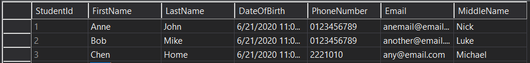
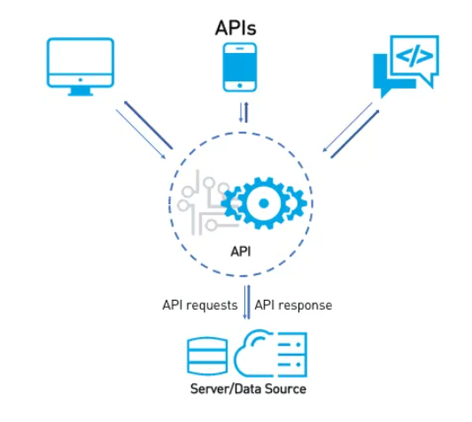

# Learning Outcomes
- Relational Database Overview
- Web API Overview
- Interaction between Database and API Server

# Relational Database Overview
Database is a structured collection of information that recognizes relations between stored items of information.

Data are stored in tables (entities) with columns (attributes).
Most software applications require a database.

Example: Student table that we are using for this module

# Web API with ASP.NET Core Overview
An Application Program Interface (API) is a set of protocols and tools for building software applications. An API specifies how software components should interact with each other.

# Interaction between Database and API

# References
1. [6 Differences between Web Services vs API (SOAP & REST examples)](https://testautomationresources.com/api-testing/differences-web-services-api/)
