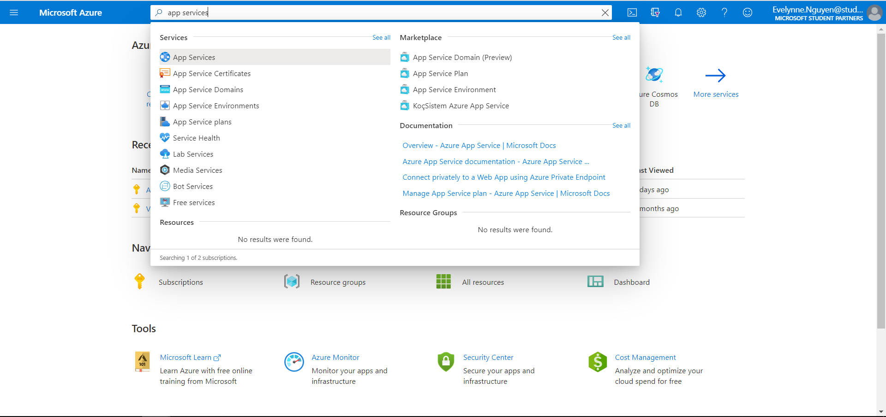
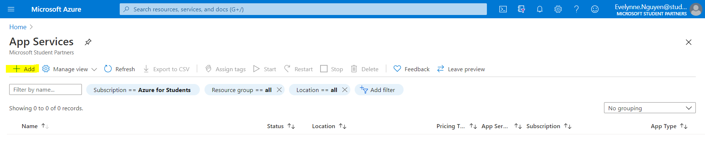
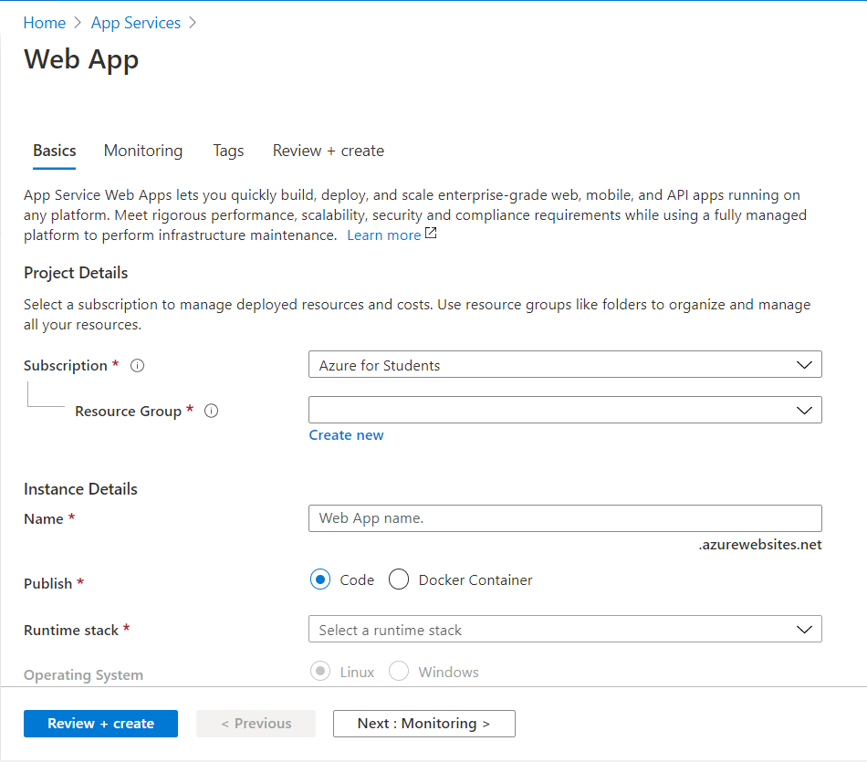
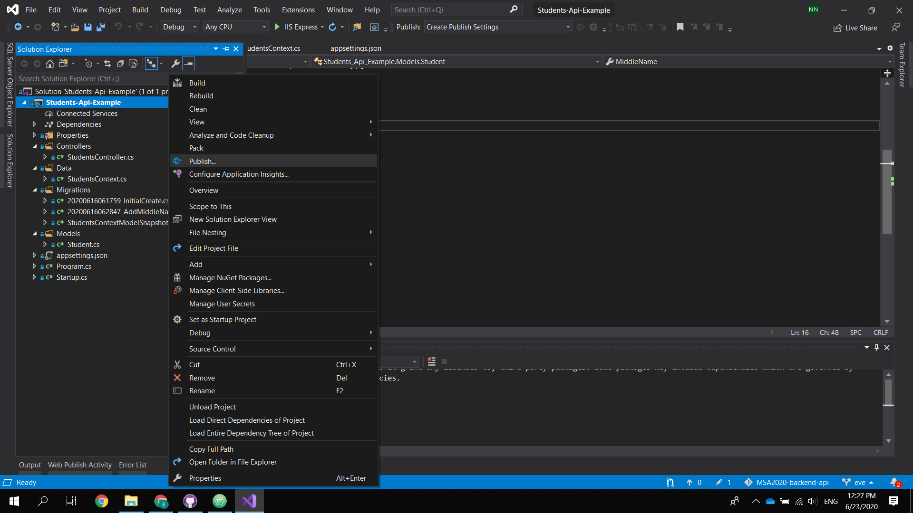

# Deploy .NET Core Web API to Azure
In this tutorial, I will show how to deploy our finished .NET CORE Web API to Azure.

## Development Environment
1. Visual Studio Community 2019, version 16.6.2
2. .NET CORE 3.1
3. Azure Student Subscription

## Deployment
In order to deploy our .NET Core Application to Azure, we need an Azure account with subscription. If you are a student, you can register a student subscription with Microsoft Azure.
Once you are ready with your Azure account, login into [Azure](http://portal.azure.com/) and search for "App Services"

From "App Services", we choose the "Add" to create a new App Service.

Then we need to fill out the following fields:

- **Subscription**: Choose "Azure for Students" if you are a student and have registered for the student subscription with Azure
- **Resource Group**: is a container that holds related resources for an Azure solution. If you don’t have existing resource group, you can click “Create new” to create one.
- **Name**: this would be your app’s name.
- **Publish**: I will choose the code option.
- **Runtime Stack**: select the correct runtime stack. For example, in this tutorial, we are using .NET Core 3.1, so I will select .NET Core 3.1.
- **Region**: select the correct region.
- **Plan**: leave as default
- **Sku and size**: Here I choose Free F1 option.

Then choose `Review and Create`

